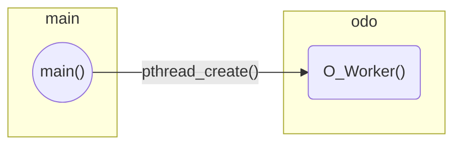

# rt-app

Sources for a real-time mobile robotics application exploiting the Linux kernel and SCHED_DEADLINE.

## Design



The application is currently structured as a single process, which in turn spawns a number of threads. The **dispatcher** thread, or main thread, is the thread created by the Linux shell when we launch the application. A variable number of **worker** threads are created and by the dispatcher, and marked for scheduling with SCHED_DEADLINE.

## Structure

The project is structured as follows:

- `docs` - The project's documentation
- `src` - The demo application's source code
   - `main.c` - The entry point of the application, and core of the dispatcher
   - `h_*.h` - Helpers and hooks
     - `h_sched.h` - Useful hooks for scheduling and such
     - `h_time.h` - Hooks to interact with timers and to do timestamping
   - `a_*.<c,h>` - Adapters for hardware platforms
     - `a_otto.<c,h>` - The adapter for IRAlab's OTTO mobile platform
   - `m_*.<c,h>` - The modules of the application, each exposing a worker
     - `m_odo.<c,h>` - The Odometry module

## Building

On apt-based system do:

```
$ sudo apt install build-essential git doxygen libnanopb-dev nanopb
```

to install dependencies, and:

```
$ make
```

to build an executable.

## Modules

The project follows a modular approach: each module must implement a quite basic public interface, consisting only of a generic worker function, which signature must be `void* (*name)(void*)`.

### Odometry

1. Encoder
   1. Coefficiente che dice a quale frazione di un arco corrisponde un tick (schedina)
1. Rototraslazione
   1. Traslo in CIR (discorde con y)
   1. Ruoto (discorde $\Delta\theta$)
   1. Ritraslo (concorde con y)
