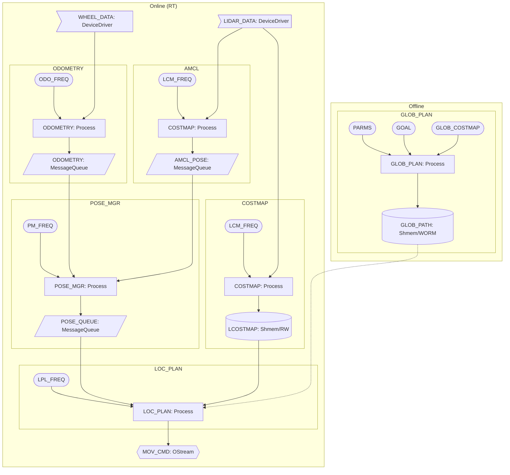
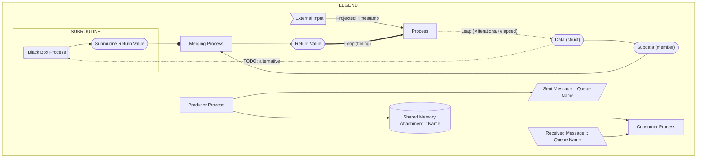
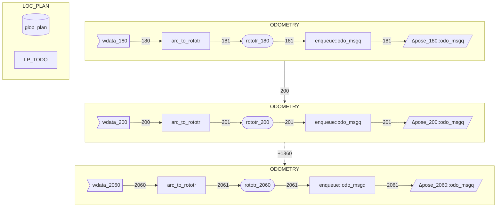

# RT-APP Diagrams

## Overview

|         Supersedes          | Supereseded By |  Updated   |
| :-------------------------: | :------------: | :--------: |
| `diagramma_applicativo.png` |      N/A       | 2020-12-18 |

The diagram that follows is an overview of the components of RT-APP.



## Legend

| Supersedes | Supereseded By |  Updated   |
| :--------: | :------------: | :--------: |
|    N/A     |      N/A       | 2020-12-18 |




## Flowchart

| Supersedes | Supereseded By |  Updated   |
| :--------: | :------------: | :--------: |
|    N/A     |      N/A       | 2020-12-18 |

The flowchart is not ready yet.

## Timing Chart

|              Supersedes              | Supereseded By |  Updated   |
| :----------------------------------: | :------------: | :--------: |
| `mermaid-diagram-20201217174645.svg` |      N/A       | 2020-12-18 |

The timing chart is a variation of the flowchart that tries to explain how the various components of RT-APP interact over time.

```mermaid
flowchart TD
	subgraph POSE_MGR
		subgraph POSE_MGR_ROUTINE_1 %% Subroutine 1: Update poses
			%% decl calc
			pm1_compose_0["compose"]
			pm1_compose_1["compose"]
			pm1_compose_2["compose"]
			%% decl data
			pm1_delta_pose_0[\"Δpose_180::odo_msgq"\]
			pm1_delta_pose_1[\"Δpose_200::odo_msgq"\]
			pm1_delta_pose_2[\"Δpose_2060::odo_msgq"\]
			pm1_pose_0("pose_160")
			pm1_pose_1("pose_180")
			pm1_pose_2("pose_2040")
			pm1_pose_3("pose_2060")
			pm1_final_pose("new_pose_2060")
			%% end decl

			pm1_delta_pose_0 --> pm1_compose_0
			pm1_pose_0 --> pm1_compose_0
			pm1_compose_0 --> pm1_pose_1
			
			pm1_delta_pose_1 --> pm1_compose_1
			pm1_pose_1 --> pm1_compose_1
			pm1_compose_1 -. +1840 .-> pm1_pose_2
			
			pm1_delta_pose_2 --> pm1_compose_2
			pm1_pose_2 --> pm1_compose_2
			pm1_compose_2 --> pm1_pose_3
		end

		subgraph POSE_MGR_ROUTINE_3
			%% decl calc
			pm3_select_accurate[select]
			%% decl data
			pm3_selected_pose_accurate("pose_172_accurate")
			%% end decl
			
			pm3_select_accurate -- ??? --> pm3_selected_pose_accurate
			pm1_pose_0 -. scegliere policy .-> pm3_select_accurate
		end

		subgraph POSE_MGR_ROUTINE_2 %% Subroutine 2: Interact with AMCL
			%% decl calc
			pm2_select_rough[select]
			pm2_select_decompose[select]
			pm2_compose["compose"]
			pm2_compute_pose_deltas["compute_Δpose(2063-172)"] 
			%% decl data
			pm2_selected_pose_rough("pose_172_rough")
			pm2_flat_pose_deltas("Δpose_(2063-172)")
			%% end decl

			pm2_select_rough -- 174 --> pm2_selected_pose_rough
			pm2_select_decompose -- 2064 --> pm2_compute_pose_deltas
		
			pm3_selected_pose_accurate -- 2064 --o pm2_compute_pose_deltas
			pm2_compute_pose_deltas -- 2065 --> pm2_flat_pose_deltas
            pm2_flat_pose_deltas --> pm2_compose
			
			pm1_pose_0 -. scegliere policy .-> pm2_select_rough
			pm1_pose_3 -. scegliere policy .-> pm2_select_decompose

			pm2_compose -- 2066 --> pm1_final_pose
		end 
	end %% POSE_MGR

	subgraph AMCL
		%% decl calc
		amcl_exec[["amcl_exec"]]
		%% decl data
		amcl_sens_data>"ldata_172"]
		amcl_sens_data_ts(["ldata_172_ts"])
		amcl_sens_data --- amcl_sens_data_ts 
		amcl_pose("amcl_pose_172")
		amcl_pose_ts("amcl_pose_172_ts")
		amcl_pose --- amcl_pose_ts
		%% end decl
		
		pm2_selected_pose_rough -- 175 --> amcl_exec
		amcl_sens_data -- 173 --> amcl_exec
		amcl_exec -- 2063 --> amcl_pose

		amcl_sens_data_ts -- 173 --> pm2_select_rough
		amcl_pose -- 2064 --o pm2_compose
		amcl_pose_ts -- 2064 --o pm2_select_decompose
	end %% AMCL

```

> ***NOTICE: The following diagrams are work-in-progress***



<!-- EOF -->