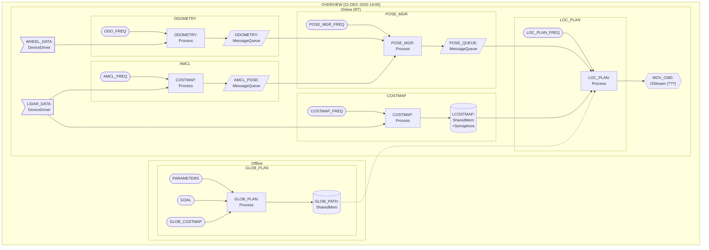

#### [🏡 Home](https://jack23247.github.io/rt-app/index) ◾ [⬅️ Back](https://jack23247.github.io/rt-app/diags) ◾ [📚 Repo](https://github.com/jack23247/rt-app)

---

```mermaid
graph TD
	subgraph OVERVIEW ["OVERVIEW [21-DEC-2020  19:05]"]
		subgraph ONLINE ["Online (RT)"]
			%% DATA
			wheel_data>"WHEEL_DATA:<br/>DeviceDriver"]
			lidar_data>"LIDAR_DATA:<br/>DeviceDriver"]
			cmd_stream{{"MOV_CMD:<br/>OStream (???)"}}

			subgraph ODOMETRY
			odo_freq([ODO_FREQ])
				odo_msgq[/"ODOMETRY:<br/>MessageQueue"/]

				odo_proc["ODOMETRY:<br/>Process"]

				odo_freq --> odo_proc
				odo_proc --> odo_msgq
			end
			wheel_data ----> odo_proc

			subgraph AMCL
				amcl_freq([AMCL_FREQ])
				amcl_msgq[/"AMCL_POSE:<br/>MessageQueue"/]

				amcl_proc["COSTMAP:<br/>Process"]

				amcl_freq --> amcl_proc
				amcl_proc --> amcl_msgq
			end
			lidar_data ----> amcl_proc

			subgraph POSE_MGR
				pm_freq([POSE_MGR_FREQ])
				pm_msgq[/POSE_QUEUE:<br/>MessageQueue/]

				pm_proc["POSE_MGR:<br/>Process"]

				pm_freq --> pm_proc
				odo_msgq ---> pm_proc
				amcl_msgq ---> pm_proc
				pm_proc --> pm_msgq
			end

			subgraph COSTMAP
				lcm_freq([COSTMAP_FREQ])
				lcm_shm[("LCOSTMAP:<br/>SharedMem<br/>+Semaphore")]

				lcm_proc["COSTMAP:<br/>Process"]

				lcm_freq --> lcm_proc
				lcm_proc --> lcm_shm
			end
			lidar_data ----> lcm_proc

			subgraph LOC_PLAN
				lpl_freq([LOC_PLAN_FREQ])

				lpl_proc[LOC_PLAN:<br/>Process]

				lpl_freq --> lpl_proc
				pm_msgq ---> lpl_proc
				lcm_shm ---> lpl_proc
			end

			lpl_proc --> cmd_stream

		end

		subgraph OFFLINE ["Offline"]
			subgraph GLOB_PLAN
				gpl_path[(GLOB_PATH:<br/>SharedMem)]

				gpl_parms([PARAMETERS])
				gpl_goal([GOAL])
				gpl_costmap(["GLOB_COSTMAP"])

				gpl_proc["GLOB_PLAN:<br/>Process"]

				gpl_parms --> gpl_proc
				gpl_goal --> gpl_proc
				gpl_costmap --> gpl_proc
				gpl_proc --> gpl_path

				gpl_path -....-> lpl_proc

			end
		end
	end
```