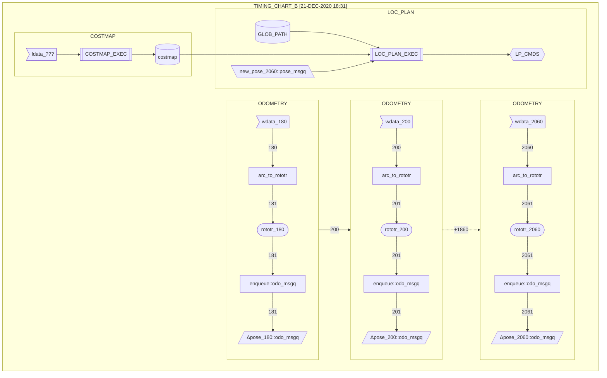

#### [🏡 Home](https://jack23247.github.io/rt-app/index) ◾ [⬅️ Back](https://jack23247.github.io/rt-app/diags) ◾ [📚 Repo](https://github.com/jack23247/rt-app)

---

```mermaid
flowchart TD
    subgraph TIMING_CHART_B ["TIMING_CHART_B [21-DEC-2020  18:31]"]
        subgraph odo_1 ["ODOMETRY"]
            odo_1_exec_1["arc_to_rototr"]
            odo_1_exec_2["enqueue::odo_msgq"]

            odo_1_whl_data>"wdata_180"]
            odo_1_data(["rototr_180"])
            odo_1_msg[/"Δpose_180::odo_msgq"/]

            odo_1_whl_data -- 180 --> odo_1_exec_1
            odo_1_exec_1 -- 181 --> odo_1_data
            odo_1_data -- 181 --> odo_1_exec_2
            odo_1_exec_2 -- 181 --> odo_1_msg
        end

        subgraph odo_2 ["ODOMETRY"]
            odo_2_exec_1["arc_to_rototr"]
            odo_2_exec_2["enqueue::odo_msgq"]

            odo_2_whl_data>"wdata_200"]
            odo_2_data(["rototr_200"])
            odo_2_msg[/"Δpose_200::odo_msgq"/]

            odo_2_whl_data -- 200 --> odo_2_exec_1
            odo_2_exec_1 -- 201 --> odo_2_data
            odo_2_data -- 201 --> odo_2_exec_2
            odo_2_exec_2 -- 201 --> odo_2_msg
        end

        subgraph odo_3 ["ODOMETRY"]
            odo_3_exec_1["arc_to_rototr"]
            odo_3_exec_2["enqueue::odo_msgq"]

            odo_3_whl_data>"wdata_2060"]
            odo_3_data(["rototr_2060"])
            odo_3_msg[/"Δpose_2060::odo_msgq"/]

            odo_3_whl_data -- 2060 --> odo_3_exec_1
            odo_3_exec_1 -- 2061 --> odo_3_data
            odo_3_data -- 2061 --> odo_3_exec_2
            odo_3_exec_2 -- 2061 --> odo_3_msg
        end

        odo_1 -- 200 --> odo_2
        odo_2 -. +1860 .-> odo_3

        subgraph COSTMAP
            cm_costmap[("costmap")]
            cm_1_lidar_data>"ldata_???"]

            cm_exec[["COSTMAP_EXEC"]]
            cm_1_lidar_data --> cm_exec
            cm_exec --> cm_costmap
        end

        subgraph LOC_PLAN
            lp_glob_path[("GLOB_PATH")]
            lp_pose[\"new_pose_2060::pose_msgq"\]

            lp_exec[[LOC_PLAN_EXEC]]

            lp_glob_path --> lp_exec
            cm_costmap ---> lp_exec
            lp_pose --> lp_exec
            lp_exec --> lp_commands{{"LP_CMDS"}}

        end
    end
```