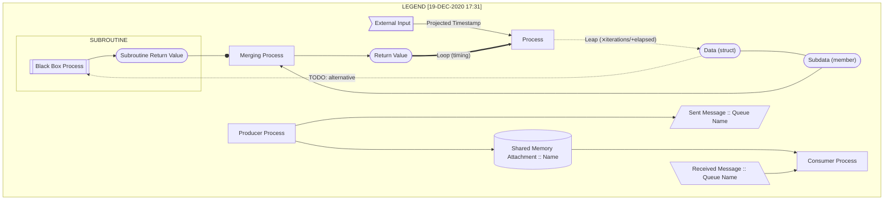

```mermaid
flowchart TD
	subgraph LEGEND ["LEGEND [19-DEC-2020  17:31]"]
		l_proc_1["Process"]
		l_proc_2["Merging Process"]

		l_input>"External Input"]
		l_data(["Data (struct)"])
		l_data_sub(["Subdata (member)"])
		l_ret_val(["Return Value"])

		l_input -- "Projected Timestamp" --> l_proc_1
		l_proc_1 -. "Leap (⨯iterations/+elapsed)" .-> l_data

		l_data --- l_data_sub
		l_data_sub ----> l_proc_2

		subgraph SUBROUTINE
			ls_proc_1[["Black Box Process"]]
			ls_ret_val(["Subroutine Return Value"])

			ls_proc_1 --> ls_ret_val
		end

		l_data -. "TODO: alternative" ..-> ls_proc_1
		ls_ret_val --o l_proc_2
		l_proc_2 --> l_ret_val

		l_ret_val == "Loop (timing)" ==> l_proc_1


		l_proc_3["Producer Process"]
		l_proc_4["Consumer Process"]
		l_shm_att[("Shared Memory Attachment :: Name")]
		l_msg_en[/Sent Message :: Queue Name/]
		l_msg_deq[\Received Message :: Queue Name\]

		l_proc_3 ---> l_shm_att
		l_shm_att ---> l_proc_4
		l_msg_deq --> l_proc_4
		l_proc_3 ----> l_msg_en

	end
```