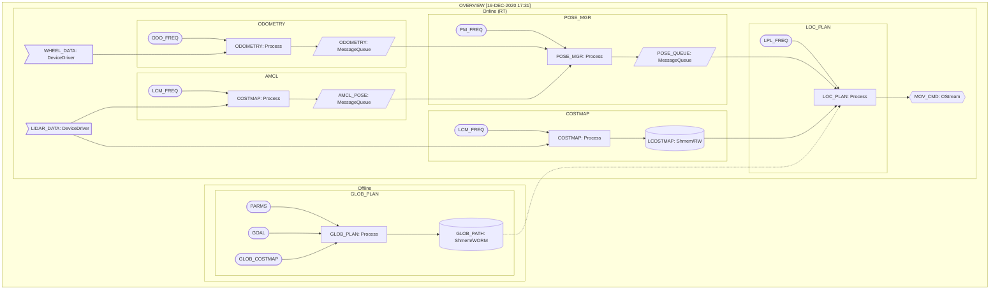

```mermaid
graph TD
	subgraph OVERVIEW ["OVERVIEW [19-DEC-2020  17:31]"]
		subgraph ONLINE ["Online (RT)"]
			%% DATA
			wheel_data>"WHEEL_DATA: DeviceDriver"]
			lidar_data>"LIDAR_DATA: DeviceDriver"]
			cmd_stream{{"MOV_CMD: OStream"}}

			subgraph ODOMETRY
			odo_freq([ODO_FREQ])
				odo_msgq[/"ODOMETRY: MessageQueue"/]

				odo_proc["ODOMETRY: Process"]

				odo_freq --> odo_proc
				odo_proc --> odo_msgq
			end
			wheel_data ----> odo_proc

			subgraph AMCL
				amcl_freq([LCM_FREQ])
				amcl_msgq[/"AMCL_POSE: MessageQueue"/]

				amcl_proc["COSTMAP: Process"]

				amcl_freq --> amcl_proc
				amcl_proc --> amcl_msgq
			end
			lidar_data ----> amcl_proc

			subgraph POSE_MGR
				pm_freq([PM_FREQ])
				pm_msgq[/POSE_QUEUE: MessageQueue/]

				pm_proc["POSE_MGR: Process"]

				pm_freq --> pm_proc
				odo_msgq ---> pm_proc
				amcl_msgq ---> pm_proc
				pm_proc --> pm_msgq
			end

			subgraph COSTMAP
				lcm_freq([LCM_FREQ])
				lcm_shm[("LCOSTMAP: Shmem/RW")]

				lcm_proc["COSTMAP: Process"]

				lcm_freq --> lcm_proc
				lcm_proc --> lcm_shm
			end
			lidar_data ----> lcm_proc

			subgraph LOC_PLAN
				lpl_freq([LPL_FREQ])

				lpl_proc[LOC_PLAN: Process]

				lpl_freq --> lpl_proc
				pm_msgq ---> lpl_proc
				lcm_shm ---> lpl_proc
			end

			lpl_proc --> cmd_stream

		end

		subgraph OFFLINE ["Offline"]
			subgraph GLOB_PLAN
				gpl_path[(GLOB_PATH: Shmem/WORM)]

				gpl_parms([PARMS])
				gpl_goal([GOAL])
				gpl_costmap(["GLOB_COSTMAP"])

				gpl_proc["GLOB_PLAN: Process"]

				gpl_parms --> gpl_proc
				gpl_goal --> gpl_proc
				gpl_costmap --> gpl_proc
				gpl_proc --> gpl_path

				gpl_path -....-> lpl_proc

			end
		end
	end
```