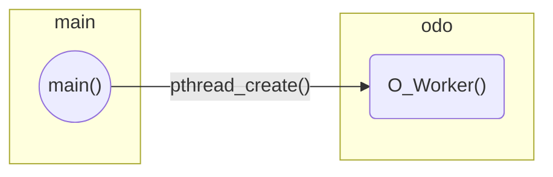

# rt-app

Sources for a real-time mobile robotics application exploiting the Linux kernel and SCHED_DEADLINE.

## Design

The application is currently structured as a single process, which in turn spawns a number of threads. The **dispatcher** thread, or main thread, is the thread created by the Linux shell when we launch the application. A variable number of **worker** threads are created and by the dispatcher, and marked for scheduling with SCHED_DEADLINE.

## Structure

The folder is structured as follows:

- `main.c` - The entry point of the application, and core of the dispatcher (about two `for` loops)
- `odo.c`/`odo.h` - The Odometry module
- `schedutil.h` - Useful hooks for scheduling and such
- `deps/` - Project dependencies, see `deps.txt`

## Modules

The project follows a modular approach: each module must implement a quite basic public interface, consisting only of a generic worker function, which signature must be `void* (*name)(void*)`.

### Odometry

1. Encoder
   1. Coefficiente che dice a quale frazione di un arco corrisponde un tick (schedina)
1. Rototraslazione
   1. Traslo in CIR (discorde con y)
   1. Ruoto (discorde $\Delta\theta$)
   1. Ritraslo (concorde con y)